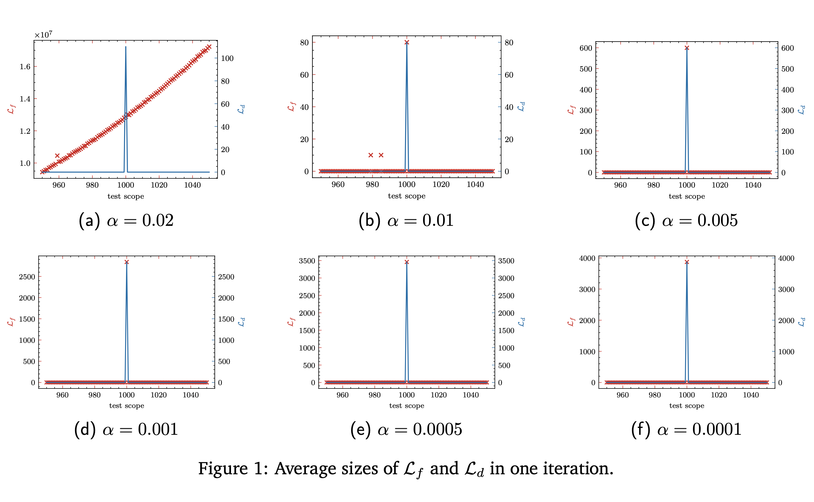

# Chose-Joux-Mitton

We improved the Chose-Joux-Mitton algorithm used in [1] and applied it to the parameter recovery of LDPC codes, and here are some intermediate results we obtained:

The simulations in the manuscript were run on a computer with a processor of \emph{Intel(R) Core(TM) i9-9900k} and 64GB of RAM. Runtimes of one iteration at $n = 1000$ are shown in the following table, where the units are seconds, and $N_\mathcal{R}$ denotes the number of rows of the matrix $\mathcal{R}$ at each iteration. The memory occupied by the program was not precisely measured, but it could be less than 1GB. It can be seen that the running time of the algorithms depends on $N_\mathcal{R}$, which is because the smaller the $N_\mathcal{R}$, the more vectors need to be detected. 

$\alpha$ | 0.02 | 0.01 | 0.005 | 0.001 | 0.0005 | 0.0001
|:-:|:-:|:-:|:-:|:-:|:-:|:-:|
improved filter + detector | 45.06 | 21.95 | 22.38 | 22.01 | 22.39 | 22.25
basic filter + detector   | 218.71 | 85.95 | 87.74 | 87.72 | 88.83 | 88.97
$N_\mathcal{R}$ | 30 | 57 | 64  | 64 | 64 | 64

When recovering the code length, the possible code length is between 996 and 1004, and the simulation results are shown below. It can be seen that when $\alpha < \alpha_s$ ($\alpha_s\approx 0.009$ is the upper bound that allows the detector to be removed in the revised manuscript), $\mathcal{L}_f$ and $\mathcal{L}_d$ have exactly the same size, which confirms our prediction. Moreover, The size of $\mathcal{L}_d$ at all the noise levels is 0 when $n \ne 1000$, which means that the search can be terminated once any single dual codeword is found. Therefore, the whole process of recovering the code length will be really efficient.

